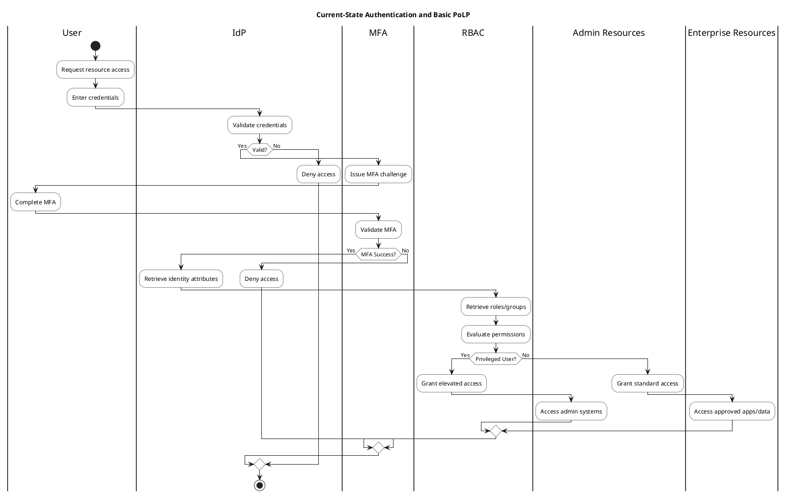
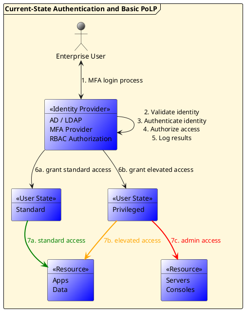
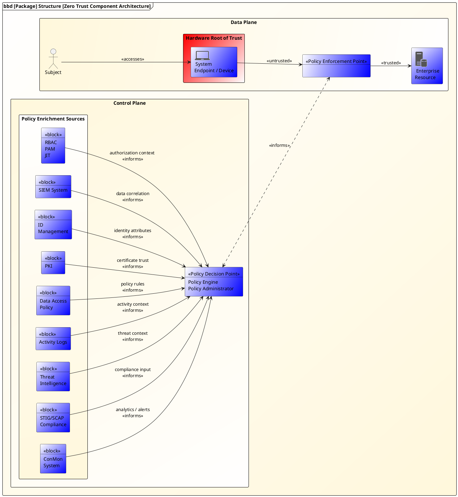

# Introduction

```plantuml
@startuml

title Current-State Authentication and Basic PoLP

skinparam shadowing false
skinparam activity {
  BackgroundColor white
  BorderColor black
}

|User|
start
:Request resource access;
:Enter credentials;

|IdP|
:Validate credentials;

if (Valid?) then (Yes)

  |MFA|
  :Issue MFA challenge;

  |User|
  :Complete MFA;

  |MFA|
  :Validate MFA;

  if (MFA Success?) then (Yes)

    |IdP|
    :Retrieve identity attributes;

    |RBAC|
    :Retrieve roles/groups;
    :Evaluate permissions;

    if (Privileged User?) then (Yes)
      :Grant elevated access;

      |Admin Resources|
      :Access admin systems;

    else (No)
      :Grant standard access;

      |Enterprise Resources|
      :Access approved apps/data;
    endif

  else (No)
    |IdP|
    :Deny access;
  endif

else (No)
  :Deny access;
endif

stop

@enduml
```

```plantuml
@startuml


skinparam frame {
  BackgroundColor cornsilk
  BorderColor black
  FontColor black
}

skinparam rectangle {
  'MinimumWidth 200
  BackgroundColor white/blue
  BorderColor black
  FontColor black
}

skinparam actor {
  BackgroundColor white/black
  BorderColor black
  FontColor black
}

frame "Current-State Authentication and Basic PoLP" as CurrentState {

  actor "Enterprise User" as User

  rectangle "<<Identity Provider>>\n___\nAD / LDAP\nMFA Provider\nRBAC Authorization" as IdP

  rectangle "<<User State>>\n___\nStandard" as Standard
  rectangle "<<User State>>\n___\nPrivileged" as Privileged

  rectangle "<<Resource>>\n___\nApps\nData" as Resources
  rectangle "<<Resource>>\n___\nServers\nConsoles" as Admin

  User <--> IdP : 1. MFA login process

  IdP --> IdP : 2. Validate identity\n3. Authenticate identity\n4. Authorize access\n5. Log results

  IdP --> Standard : 6a. grant standard access
  IdP --> Privileged : 6b. grant elevated access

  Standard --> Resources #line:green;line.bold;text:green : 7a. standard access
  Privileged --> Resources #line:orange;line.bold;text:orange : 7b. elevated access
  Privileged --> Admin #line:red;line.bold;text:red : 7c. admin access
}

@enduml
```

```plantuml
@startuml

!include <tupadr3/common>
!include <office/Servers/database_server>
!include <office/Devices/device_laptop>

left to right direction
skinparam rectangle {
  BackgroundColor white/blue
  BorderColor black
  FontColor black
}
skinparam frame {
  BackgroundColor white/cornsilk
  BorderColor black
  FontColor black
}
frame "bbd [Package] Structure [Zero Trust Component Architecture]" as ZTA {
    rectangle "Data Plane" as DP #cornsilk/white {
    actor "Subject" as Subject
    rectangle "Hardware Root of Trust" as ROOT #red/white {
      OFF_DEVICE_LAPTOP(Sys,System\nEndpoint / Device)
    }
    rectangle "<<Policy Enforcement Point>>\n___\n" as PEP
    OFF_DATABASE_SERVER(DB,Enterprise\nResource)

    Subject --> Sys : <<accesses>>
    Sys --> PEP : <<untrusted>>
    PEP --> DB : <<trusted>>
    }
    rectangle "Control Plane" as CP #cornsilk/white {
      rectangle "Policy Enrichment Sources" as DES #white/cornsilk {
        rectangle "<<block>>\n___\nConMon\nSystem" as ConMon
        rectangle "<<block>>\n___\nSTIG/SCAP\nCompliance" as Compliance
        rectangle "<<block>>\n___\nThreat\nIntelligence" as ThreatIntel
        rectangle "<<block>>\n___\nActivity Logs" as Logs
        rectangle "<<block>>\n___\nData Access\nPolicy" as DAP
        rectangle "<<block>>\n___\nPKI" as PKI
        rectangle "<<block>>\n___\nID\nManagement" as IDM
        rectangle "<<block>>\n___\nSIEM System" as SIEM
        rectangle "<<block>>\n___\nRBAC\nPAM\nJIT" as RBAC
      }
      rectangle "<<Policy Decision Point>>\n___\nPolicy Engine\nPolicy Administrator" as PDP
      }
    PDP <..> PEP : <<informs>>
  }
}

ConMon --> PDP : analytics / alerts\n<<informs>>
Compliance --> PDP : compliance input\n<<informs>>
ThreatIntel --> PDP : threat context\n<<informs>>
Logs --> PDP : activity context\n<<informs>>
DAP --> PDP : policy rules\n<<informs>>
PKI --> PDP : certificate trust\n<<informs>>
IDM --> PDP : identity attributes\n<<informs>>
SIEM --> PDP : data correlation\n<<informs>>
RBAC --> PDP : authorization context \n<<informs>>

@enduml

```
